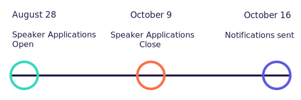

The following topics help summarize what ELA Conf is all about. This list is for guidance and inspiration so please don’t worry if your abstract does not fit perfectly within any of these.

**When you are ready to officially submit your talk abstract you can [fill out the speaker application here](http://goo.gl/forms/8iz7wdRLaa) and feel free to [contact us](mailto:hello@elaconf.com) with any questions.**

*You can find the [lightning talk application here](http://goo.gl/forms/lRSWCTrXe8).*

## Important Dates

## Topics

### Speaking

Feeling confident and prepared to speak to a group or at a conference is at the heart of ELA Conf. We are looking for women to present to the group through practical workshops and inspiring talks on all things related to speaking in tech. For example, a workshop abstract could include having participants break out into smaller groups to present and give each other constructive feedback. Any advice for those looking to get started speaking and how they may overcome any fear here?

### Writing

So much of being a leader is successful communication and teaching others, which doesn't always have to be in the form of public speaking and presentations. Share your thoughts and experiences regarding how and where to get started as a writer, tips on improving one's writing, and how to make it as direct and educational as possible.

### Sharing What You Learn: Becoming A Teacher

Beginners and experienced people alike make great teachers. As a beginner, the struggles of a topic are fresh in your mind and communicating these struggles from the perspective of a beginner is invaluable to other people in the same situation. We are also able to better retain what we learn as we communicate it to others. What is the last thing you learned about and immediately taught someone else? How exactly did you present this information; through writing, in-person presentations, a video, a demo?

### Getting Started With An Open Source Project

Contributing to an open source project can be a very rewarding and educational experience. Not all open source projects are created equally though. Share your experience on how you got started with a particular project, what you have learned as a result, and any advice you have for others interested in becoming part of a project but don’t know where to start.

### Succeeding As A Female Founder

Share your story. What did you found/co-found? What challenges did you face/are still facing that you feel were unique to being a women and how did you rise above them? Tell us about the very first step you took towards this project/product and what you found to be an invaluable resource along the way.

### Negotiating a Promotion/Raise

It’s a fact, women are generally only likely to ask for a raise when we feel 100% qualified. How do we eliminate this assumption and empower one another to have the confidence needed to negotiate such things? What are the politics associated with asking for a promotion/raise and how should it actually be done?

### Giving Back To The Community

We are all part of a community that loves to share things for free. It’s not uncommon for someone to pursue an entire technical education on the web from people that are happy to just share their knowledge. How have you given back to the community recently? Have you built/written/taught anything that you could tell us about? What have been the benefits for both yourself and the audience?

<!--### The Self-Taught Journey

There are so many women with very unique stories related to how they got started in tech and how they obtained the foundational knowledge necessary to get a job. Did you go through a complete career change? Use online resources or books to teach yourself? The journey to a self-taught career can be a great source of inspiration as more and more women break into the industry this way.
-->

### Mentorship Stories

Being a part of a meaningful mentorship can be invaluable. Has there been someone in your life that has been a source of inspiration, feedback, and advice concerning your career? We’d love to hear about about how your mentorship relationship came to be, what makes it so special, and what you have gotten out of it.

### Importance of Passion Projects

Sometimes the most significant and educational things we accomplish are from the personal projects we get ourselves into on nights and weekends. Tell us about your latest passion project: how did it come to be, who helped you, what did you learn, how is your project helping others?

<!--### Combating Imposter Syndrome

Imposter syndrome is very real and can be completely debilitating. Beginners and experienced women alike can often feel like they will be “found out” and have no place speaking at conferences or writing articles, for example. How do we overcome this to make room for more women to be in positions of leadership in tech? What are some tips and tricks regarding keeping this at bay and forging ahead to do things that are often intimidating and potentially uncomfortable? Overcoming self-doubt can often be the most significant change on the path to leadership.
-->

### Self-Care
Tech can be all consuming if you let it. There is and always will be so much to learn. It can often feel like as soon as you get the hang of something there’s a new/best practice way for it to be done. On top of learning we often have jobs and passion projects that we are involved in. It’s also nice to attend classes and local events. Peers may ask for assistance with a project or to review their latest blog post. A friend might need a logo put together. It’s endless. How do we learn how and when to say “no”. What rules do you have for yourself in terms of breaks and downtime? Share advice for staying healthy, happy, and sane in an industry that will take everything if we let it.

**Have we overlooked anything? Submit a talk application with your abstract!**
